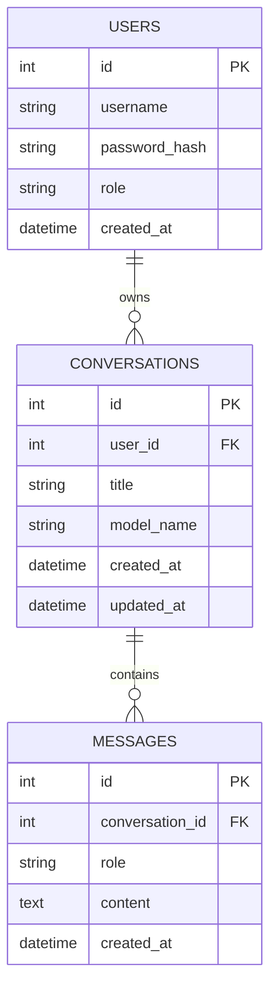
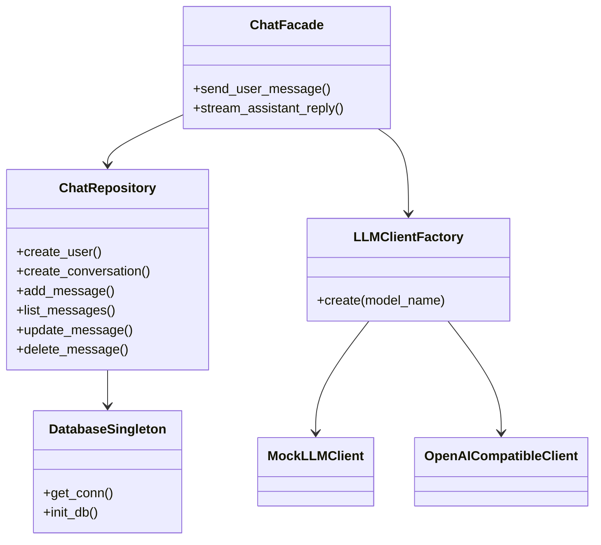

# 智能对话系统（课程项目）

一个基于 Flask + SQLite 的多轮对话系统示例，实现了：
- 多轮会话聊天（支持上下文）
- 会话/消息持久化（SQLite）
- 用户登录与基础权限控制
- 流式输出（SSE）
- 会话切换、消息编辑/删除
- 多模型切换入口（mock + deepseek）

## 1. 快速启动

```bash
python -m venv .venv
source .venv/bin/activate
pip install -r requirements.txt
python app.py
```

浏览器打开：`http://127.0.0.1:5000`

> 默认模型使用 `mock`，无需 API Key。若使用 deepseek，请设置：
>
> - `DEEPSEEK_API_KEY`
> - `DEEPSEEK_BASE_URL`（可选，默认 `https://api.deepseek.com/v1`）

---

## 2. 系统架构图

```mermaid
flowchart LR
    UI[Web UI\nFlask Templates + JS] --> Controller[Flask Routes]
    Controller --> Facade[ChatFacade\n(门面模式)]
    Facade --> Repo[ChatRepository]
    Repo --> DB[(SQLite)]
    Facade --> Factory[LLMClientFactory\n(工厂模式)]
    Factory --> Mock[MockLLMClient]
    Factory --> OA[OpenAICompatibleClient]
    Repo --> Singleton[DatabaseSingleton\n(单例模式)]
    Singleton --> DB
```

---

## 3. 数据库 ER 图



---

## 4. 设计模式应用说明

### 4.1 单例模式（Singleton）
- 位置：`chat_system/db.py` 中 `DatabaseSingleton`
- 场景：管理数据库初始化与连接创建
- 优势：统一入口，避免重复初始化，提高资源管理一致性

### 4.2 工厂模式（Factory）
- 位置：`chat_system/llm.py` 中 `LLMClientFactory`
- 场景：按模型名称创建不同 LLM 客户端（mock/deepseek/未来扩展）
- 优势：解耦“创建逻辑”和“使用逻辑”，提升扩展性

### 4.3 门面模式（Facade）
- 位置：`chat_system/service.py` 中 `ChatFacade`
- 场景：统一封装会话、消息、模型调用流程给 Web 层
- 优势：简化控制器代码，降低模块耦合，提升可维护性

---

## 5. UML 类图（简化）



---

## 6. 功能覆盖清单

- [x] 新建会话
- [x] 输入用户消息
- [x] 调用模型 API 获取回复
- [x] 页面显示历史消息
- [x] user/assistant 消息写入 SQLite
- [x] 切换查看不同会话
- [x] 用户登录
- [x] 权限管理（基础）
- [x] 多模型切换入口（预留+mock/deepseek）
- [x] 前端美化
- [x] 流式输出
- [x] 删除/编辑消息
- [x] 向量数据库入口（预留）
- [x] 复杂缓存入口（预留）

---

## 7. 系统运行截图（请按运行后补充）

- 对话界面截图：见 `docs/screenshots/chat.png`（建议自行运行后保存）
- 数据库记录截图：可使用 SQLite 可视化工具查看 `chat_system.db`
